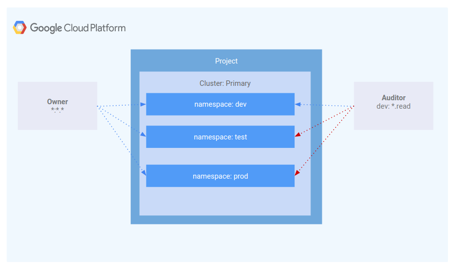
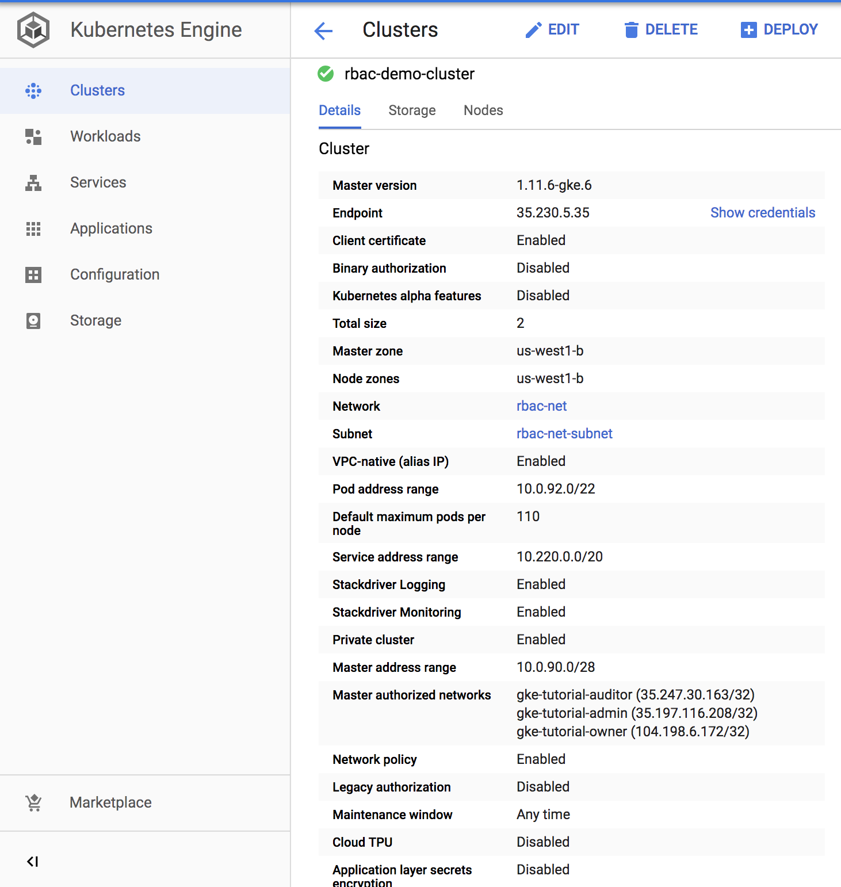
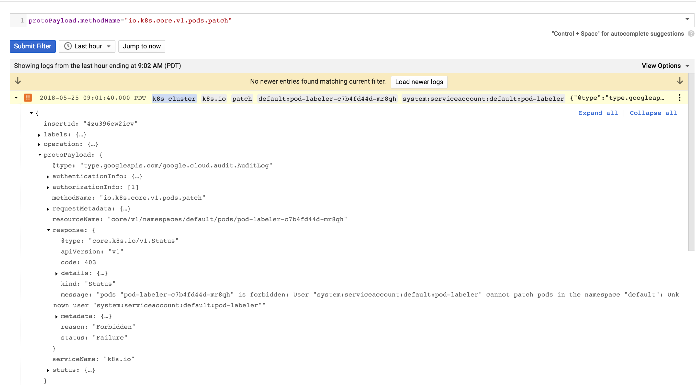
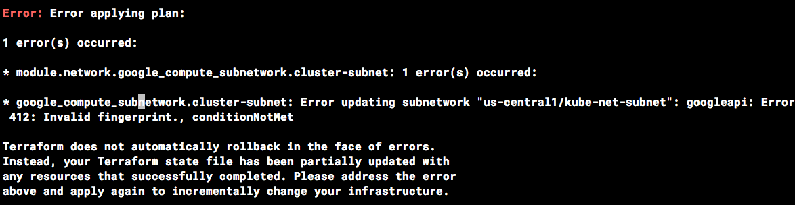

# Using Role-Based Access Control in Kubernetes Engine

## Table of Contents

<!-- TOC -->

* [Introduction](#introduction)
* [Architecture](#architecture)
* [Deployment](#deployment)
  * [Authenticate gcloud](#authenticate-gcloud)
  * [Configure gcloud settings](#configuring-gcloud-settings)
  * [Setup this project](#setup-this-project)
  * [Cluster Deployment](#cluster-deployment)
  * [Provisioning the Kubernetes Engine Cluster](#provisioning-the-kubernetes-engine-cluster)
* [Validation](#validation)
* [Scenario 1: Assigning permissions by user persona](#scenario-1-assigning-permissions-by-user-persona)
  * [IAM - Role](#iam---role)
    * [IAM - User](#iam---user)
  * [Description of the test environment:](#description-of-the-test-environment)
  * [Create the namespaces with:](#create-the-namespaces-with)
  * [Create the roles with:](#create-the-roles-with)
  * [Create the role bindings with:](#create-the-role-bindings-with)
  * [Create a test pod with:](#create-a-test-pod-with)
  * [Inspect it:](#inspect-it)
* [Scenario 2: Assigning API permissions to a cluster application](#scenario-2-assigning-api-permissions-to-a-cluster-application)
  * [Deploying the sample application](#deploying-the-sample-application)
  * [Diagnosing an RBAC misconfiguration](#diagnosing-an-rbac-misconfiguration)
  * [Fixing the serviceAccountName](#fixing-the-serviceaccountname)
  * [Diagnosing insufficient privileges](#diagnosing-insufficient-privileges)
  * [Identifying the application's role and permissions](#identifying-the-applications-role-and-permissions)
  * [Adding permissions to a role](#adding-permissions-to-a-role)
  * [Verifying successful configuration](#verifying-successful-configuration)
  * [Key takeaways](#key-takeaways)
* [Tear down](#tear-down)
* [Troubleshooting](#troubleshooting)
  * [Invalid fingerprint error during terraform apply](#invalid-fingerprint-error-during-terraform-apply)
* [Relevant Material](#relevant-material)

<!-- TOC -->

## Introduction

This tutorial covers the usage and debugging of [role-based access control (RBAC)](https://kubernetes.io/docs/reference/access-authn-authz/rbac/) in a Kubernetes Engine cluster.

While RBAC resource definitions are standard across all Kubernetes platforms. Their interaction with underlying authentication and authorization providers need to be understood when building on any cloud provider.

RBAC is a powerful security mechanism that provides great flexibility in how you restrict operations within a cluster. This tutorial will cover two use cases for RBAC:

1. Assigning different permissions to user personas, namely owners and auditors.
1. Granting limited API access to an application running within your cluster.

Since RBAC's flexibility can occasionally result in complex rules, common steps for troubleshooting RBAC are included as part of scenario 2.

## Architecture

This tutorial focuses on the use of RBAC within a Kubernetes Engine cluster. It demonstrates how varying levels of cluster privilege can be granted to different user personas. In particular, you will provision two service accounts to represent user personas and three namespaces: dev, test, and prod. The "owner" persona will have read-write access to all three namespaces, while the "auditor" persona will have read-only access and be restricted to the dev namespace.



## Deployment

The steps below will walk you through using terraform to deploy a Kubernetes Engine cluster that you will then use for installing test users, applications and RBAC roles.

### Authenticate gcloud

Prior to running this demo, ensure you have authenticated your gcloud client by running the following command:

```console
gcloud auth application-default login
```

### Configure gcloud settings

Run `gcloud config list` and make sure that `compute/zone`, `compute/region` and `core/project` are populated with values that work for you. You can set their values with the following commands:

```console
# Where the region is us-east1
gcloud config set compute/region us-east1

Updated property [compute/region].
```

```console
# Where the zone inside the region is us-east1-c
gcloud config set compute/zone us-east1-c

Updated property [compute/zone].
```

```console
# Where the project name is my-project-name
gcloud config set project my-project-name

Updated property [core/project].
```

### Setup this project

This project requires the following Google Cloud Service APIs to be enabled:

* `compute.googleapis.com`
* `container.googleapis.com`
* `cloudbuild.googleapis.com`

In addition, the terraform configuration takes three parameters to determine where the Kubernetes Engine cluster should be created:

* `project`
* `region`
* `zone`

These parameters will be configured based on your gcloud default settings from the prior step.

### Provisioning the Kubernetes Engine Cluster

Next, apply the terraform configuration with:

```console
# From within the project root, use make to apply the terraform
make create
```

When prompted if you want to deploy the plan, review the generated plan and enter `yes` to deploy the environment.

## Validation

Once complete, terraform will output a message indicating successful creation of the cluster.

```console
...snip...
google_container_cluster.primary: Still creating... (2m50s elapsed)
google_container_cluster.primary: Still creating... (3m0s elapsed)
google_container_cluster.primary: Still creating... (3m10s elapsed)
google_container_cluster.primary: Still creating... (3m20s elapsed)
google_container_cluster.primary: Creation complete after 3m24s (ID: rbac-demo-cluster)

Apply complete! Resources: 14 added, 0 changed, 0 destroyed.
```

You can also confirm the cluster was created successfully by logging into the cloud console and ensuring that Legacy Authorization is disabled for the new cluster.



## Scenario 1: Assigning permissions by user persona

### IAM - Role

A role named `kube-api-ro-xxxxxxxx` (where `xxxxxxxx` is a random string) has been created with the permissions below as part of the terraform configuration in `iam.tf`. These permissions are the minimum required for any user that requires access to the Kubernetes API.

1. container.apiServices.get
1. container.apiServices.list
1. container.clusters.get
1. container.clusters.getCredentials

### Simulating users

Three service accounts have been created to act as Test Users:

* admin: has admin permissions over the cluster and all resources
* owner: has read-write permissions over common cluster resources
* auditor: has read-only permissions within the dev namespace only

```console
gcloud iam service-accounts list

NAME                                    EMAIL
GKE Tutorial Admin                      gke-tutorial-admin@myproject.iam.gserviceaccount.com
GKE Tutorial Auditor                    gke-tutorial-auditor@myproject.iam.gserviceaccount.com
GKE Tutorial Owner                      gke-tutorial-owner@myproject.iam.gserviceaccount.com
```

Three test hosts have been provisioned by the terraform script. Each node has `kubectl` and `gcloud` installed and configured to simulate a different user persona.

* __gke-tutorial-admin__: kubectl and gcloud are authenticated as a cluster administrator.
* __gke-tutorial-owner__: simulates the 'owner' account
* __gke-tutorial-auditor__: simulates the 'auditor'account

```console
gcloud compute instances list

NAME                                             ZONE           MACHINE_TYPE   PREEMPTIBLE  INTERNAL_IP  EXTERNAL_IP     STATUS
rbac-demo-cluster-default-pool-a9cd3468-4vpc    us-central1-a  n1-standard-1                10.0.96.5                    RUNNING
rbac-demo-cluster-default-pool-a9cd3468-b47f    us-central1-a  n1-standard-1                10.0.96.6                    RUNNING
rbac-demo-cluster-default-pool-a9cd3468-rt5p    us-central1-a  n1-standard-1                10.0.96.7                    RUNNING
gke-tutorial-auditor                            us-central1-a  f1-micro                     10.0.96.4    35.224.148.28    RUNNING
gke-tutorial-admin                              us-central1-a  f1-micro                     10.0.96.3    35.226.237.142   RUNNING
gke-tutorial-owner                              us-central1-a  f1-micro                     10.0.96.2    35.194.58.130    RUNNING
```

### Creating the RBAC rules

Create the the namespaces, Roles, and RoleBindings by logging into the admin instance and applying the `rbac.yaml` manifest:

Input:

```console
# SSH to the admin
gcloud compute ssh gke-tutorial-admin
```

Create the namespaces, roles, and bindings

```console
kubectl apply -f ./manifests/rbac.yaml

namespace "dev" created
namespace "prod" created
namespace "test" created
role.rbac.authorization.k8s.io "dev-ro" created
clusterrole.rbac.authorization.k8s.io "all-rw" created
clusterrolebinding.rbac.authorization.k8s.io "owner-binding" created
rolebinding.rbac.authorization.k8s.io "auditor-binding" created
```

### Managing resources as the owner

In a new terminal, ssh into the owner instance and create a simple deployment in each namespace:

```console
# SSH to the "owner" instance
gcloud compute ssh gke-tutorial-owner
```

Create a server in each namespace:

```console
kubectl create -n dev -f ./manifests/hello-server.yaml

service/hello-server created
deployment.apps/hello-server created
```

```console
kubectl create -n prod -f ./manifests/hello-server.yaml

service/hello-server created
deployment.apps/hello-server created
```

```console
kubectl create -n test -f ./manifests/hello-server.yaml

service/hello-server created
deployment.apps/hello-server created
```

As the owner, you will also be able to view all pods:

```console
# On the "owner" instance

# List all hello-server pods in all namespaces
kubectl get pods -l app=hello-server --all-namespaces

NAMESPACE   NAME                            READY     STATUS    RESTARTS   AGE
dev         hello-server-6c6fd59cc9-h6zg9   1/1       Running   0          6m
prod        hello-server-6c6fd59cc9-mw2zt   1/1       Running   0          44s
test        hello-server-6c6fd59cc9-sm6bs   1/1       Running   0          39s
```

### Viewing resources as the auditor

In a new terminal, ssh into the auditor instance and try to view all namespaces:

```console
# SSH to the "auditor" instance
gcloud compute ssh gke-tutorial-auditor
```

Attempt to list all pods

```console
# On the "auditor" instance

# List all hello-server pods in all namespaces
kubectl get pods -l app=hello-server --all-namespaces

Error from server (Forbidden): pods is forbidden: User "gke-tutorial-auditor@myproject.iam.gserviceaccount.com" cannot list pods at the cluster scope: Required "container.pods.list" permission
```

The error indicates you don't have sufficient permissions. The auditor is restricted to viewing only the resources in the dev namespace, so you'll need to specify the namespace when viewing resources.

Attempt to view pods in the dev namespace

```console
# On the "auditor" instance
kubectl get pods -l app=hello-server --namespace=dev

NAME                            READY     STATUS    RESTARTS   AGE
hello-server-6c6fd59cc9-h6zg9   1/1       Running   0          13m
```

Attempt to view pods in the test namespace

```console
# On the "auditor" instance
kubectl get pods -l app=hello-server --namespace=test

Error from server (Forbidden): pods is forbidden: User "gke-tutorial-auditor@myproject.iam.gserviceaccount.com" cannot list pods in the namespace "test": Required "container.pods.list" permission.
```

Attempt to view pods in the prod namespace

```console
# On the "auditor" instance
kubectl get pods -l app=hello-server --namespace=prod

Error from server (Forbidden): pods is forbidden: User "gke-tutorial-auditor@myproject.iam.gserviceaccount.com" cannot list pods in the namespace "prod": Required "container.pods.list" permission.
```

Finally, verify the that the auditor has read-only access by trying to create and delete a deployment in the dev namespace:

```console
# On the "auditor" instance

# Attempt to create a deployment
kubectl create -n dev -f manifests/hello-server.yaml

Error from server (Forbidden): error when creating "manifests/hello-server.yaml": services is forbidden: User "gke-tutorial-auditor@myproject.iam.gserviceaccount.com" cannot create services in the namespace "dev": Required "container.services.create" permission.
Error from server (Forbidden): error when creating "manifests/hello-server.yaml": deployments.extensions is forbidden: User "gke-tutorial-auditor@myproject.iam.gserviceaccount.com" cannot create deployments.extensions in the namespace "dev": Required "container.deployments.create" permission.
```

```console
# On the "auditor" instance

# Attempt to delete the deployment
kubectl delete deployment -n dev -l app=hello-server

Error from server (Forbidden): deployments.extensions "hello-server" is forbidden: User "gke-tutorial-auditor@myproject.iam.gserviceaccount.com" cannot update deployments.extensions in the namespace "dev": Required "container.deployments.update" permission.
```

## Scenario 2: Assigning API permissions to a cluster application

In this scenario you'll go through the process of deploying an application that requires access to the Kubernetes API as well as configure RBAC rules while troubleshooting some common use cases.

### Deploying the sample application

The sample application will run as a single pod that periodically retrieves all pods in the default namespace from the API server and then applies a timestamp label to each one.

Deploy the pod-labeler application. This will also deploy a Role, ServiceAccount, and RoleBinding for the pod.

```console
# SSH to the admin instance
gcloud compute ssh gke-tutorial-admin

# Apply the pod-labeler configuration
kubectl apply -f manifests/pod-labeler.yaml

role.rbac.authorization.k8s.io/pod-labeler created
serviceaccount/pod-labeler created
rolebinding.rbac.authorization.k8s.io/pod-labeler created
deployment.apps/pod-labeler created
```

### Diagnosing an RBAC misconfiguration

Now check the status of the pod. Once the container has finished creating, you'll see it error out. Investigate the error by inspecting the pods' events and logs

```console
# On the admin instance

# Check the pod status
kubectl get pods -l app=pod-labeler

NAME                           READY     STATUS    RESTARTS   AGE
pod-labeler-6d9757c488-tk6sp   0/1       Error     1          1m
```

```console
# On the admin instance

# View the pod event stream
kubectl describe pod -l app=pod-labeler | tail -n 20

Events:
  Type     Reason     Age                     From                                                       Message
  ----     ------     ----                    ----                                                       -------
  Normal   Scheduled  7m35s                   default-scheduler                                          Successfully assigned default/pod-labeler-5b4bd6cf9-w66jd to gke-rbac-demo-cluster-default-pool-3d348201-x0pk
  Normal   Pulling    7m34s                   kubelet, gke-rbac-demo-cluster-default-pool-3d348201-x0pk  pulling image "gcr.io/pso-examples/pod-labeler:0.1.5"
  Normal   Pulled     6m56s                   kubelet, gke-rbac-demo-cluster-default-pool-3d348201-x0pk  Successfully pulled image "gcr.io/pso-examples/pod-labeler:0.1.5"
  Normal   Created    5m29s (x5 over 6m56s)   kubelet, gke-rbac-demo-cluster-default-pool-3d348201-x0pk  Created container
  Normal   Pulled     5m29s (x4 over 6m54s)   kubelet, gke-rbac-demo-cluster-default-pool-3d348201-x0pk  Container image "gcr.io/pso-examples/pod-labeler:0.1.5" already present on machine
  Normal   Started    5m28s (x5 over 6m56s)   kubelet, gke-rbac-demo-cluster-default-pool-3d348201-x0pk  Started container
  Warning  BackOff    2m25s (x23 over 6m52s)  kubelet, gke-rbac-demo-cluster-default-pool-3d348201-x0pk  Back-off restarting failed container

```

```console
# On the admin instance

# Check the pod's logs
kubectl logs -l app=pod-labeler

Attempting to list pods
Traceback (most recent call last):
  File "label_pods.py", line 13, in <module>
    ret = v1.list_namespaced_pod("default",watch=False)
  File "build/bdist.linux-x86_64/egg/kubernetes/client/apis/core_v1_api.py", line 12310, in list_namespaced_pod
  File "build/bdist.linux-x86_64/egg/kubernetes/client/apis/core_v1_api.py", line 12413, in list_namespaced_pod_with_http_info
  File "build/bdist.linux-x86_64/egg/kubernetes/client/api_client.py", line 321, in call_api
  File "build/bdist.linux-x86_64/egg/kubernetes/client/api_client.py", line 155, in __call_api
  File "build/bdist.linux-x86_64/egg/kubernetes/client/api_client.py", line 342, in request
  File "build/bdist.linux-x86_64/egg/kubernetes/client/rest.py", line 231, in GET
  File "build/bdist.linux-x86_64/egg/kubernetes/client/rest.py", line 222, in request
kubernetes.client.rest.ApiException: (403)
Reason: Forbidden
HTTP response headers: HTTPHeaderDict({'Date': 'Fri, 25 May 2018 15:33:15 GMT', 'Audit-Id': 'ae2a0d7c-2ab0-4f1f-bd0f-24107d3c144e', 'Content-Length': '307', 'Content-Type': 'application/json', 'X-Content-Type-Options': 'nosniff'})
HTTP response body: {"kind":"Status","apiVersion":"v1","metadata":{},"status":"Failure","message":"pods is forbidden: User \"system:serviceaccount:default:default\" cannot list pods in the namespace \"default\": Unknown user \"system:serviceaccount:default:default\"","reason":"Forbidden","details":{"kind":"pods"},"code":403}
```

Based on this error, you can see a permissions error when trying to list pods via the API. The next step is to confirm you are using the correct ServiceAccount:

### Fixing the serviceAccountName

By inspecting the pod's configuration, you can see it is using the default ServiceAccount rather than the custom Service Account:

```console
# On the admin instance

kubectl get pod -oyaml -l app=pod-labeler

...
restartPolicy: Always
schedulerName: default-scheduler
securityContext: {}
serviceAccount: default
...
```

The `pod-labeler-fix-1.yaml` file contains the fix in the deployment's template spec:

```yaml
      # Fix 1, set the serviceAccount so RBAC rules apply
      serviceAccount: pod-labeler
```

Apply the fix and view the resulting change:

```console
# On the admin instance

# Apply the fix 1
kubectl apply -f manifests/pod-labeler-fix-1.yaml

role.rbac.authorization.k8s.io/pod-labeler unchanged
serviceaccount/pod-labeler unchanged
rolebinding.rbac.authorization.k8s.io/pod-labeler unchanged
deployment.apps/pod-labeler configured
```

```console
# On the admin instance

# View the change in the deployment configuration
kubectl get deployment pod-labeler -oyaml

  ...
  restartPolicy: Always
  schedulerName: default-scheduler
  securityContext: {}
  serviceAccount: pod-labeler
  ...

```

### Diagnosing insufficient privileges

Once again, check the status of your pod and you'll notice it is still erring out, but with a different message this time.

```console
# On the admin instance

# Check the status of your pod
kubectl get pods -l app=pod-labeler

NAME                          READY     STATUS             RESTARTS   AGE
pod-labeler-c7b4fd44d-mr8qh   0/1       CrashLoopBackOff   3          1m

```

```console
# On the admin instance

# Check the pod's logs
kubectl logs -l app=pod-labeler

Attempting to list pods
labeling pod pod-labeler-c7b4fd44d-mr8qh
Traceback (most recent call last):
  File "label_pods.py", line 22, in <module>
    api_response = v1.patch_namespaced_pod(name=i.metadata.name, namespace="default", body=body)
  File "build/bdist.linux-x86_64/egg/kubernetes/client/apis/core_v1_api.py", line 15376, in patch_namespaced_pod
  File "build/bdist.linux-x86_64/egg/kubernetes/client/apis/core_v1_api.py", line 15467, in patch_namespaced_pod_with_http_info
  File "build/bdist.linux-x86_64/egg/kubernetes/client/api_client.py", line 321, in call_api
  File "build/bdist.linux-x86_64/egg/kubernetes/client/api_client.py", line 155, in __call_api
  File "build/bdist.linux-x86_64/egg/kubernetes/client/api_client.py", line 380, in request
  File "build/bdist.linux-x86_64/egg/kubernetes/client/rest.py", line 286, in PATCH
  File "build/bdist.linux-x86_64/egg/kubernetes/client/rest.py", line 222, in request
kubernetes.client.rest.ApiException: (403)
Reason: Forbidden
HTTP response headers: HTTPHeaderDict({'Date': 'Fri, 25 May 2018 16:01:40 GMT', 'Audit-Id': '461fa750-57c9-4fea-8717-f1778828417f', 'Content-Length': '385', 'Content-Type': 'application/json', 'X-Content-Type-Options': 'nosniff'})
HTTP response body: {"kind":"Status","apiVersion":"v1","metadata":{},"status":"Failure","message":"pods \"pod-labeler-c7b4fd44d-mr8qh\" is forbidden: User \"system:serviceaccount:default:pod-labeler\" cannot patch pods in the namespace \"default\": Unknown user \"system:serviceaccount:default:pod-labeler\"","reason":"Forbidden","details":{"name":"pod-labeler-c7b4fd44d-mr8qh","kind":"pods"},"code":403}
```

Since this is failing on a PATCH operation, you can also see the error in stackdriver. This is useful if the application logs are not sufficiently verbose:

```console

On Stackdriver Logging page, click on the 'Advance filter' option and filter by:

protoPayload.methodName="io.k8s.core.v1.pods.patch"

```



### Identifying the application's role and permissions

Use the ClusterRoleBinding to find the ServiceAccount's Role and permissions

```yaml
# On the admin instance

# Inspect the rolebinding definition
kubectl get rolebinding pod-labeler -oyaml

apiVersion: rbac.authorization.k8s.io/v1
kind: RoleBinding
metadata:
  creationTimestamp: 2018-06-01T18:49:18Z
  name: pod-labeler
  namespace: default
  resourceVersion: "8309"
  selfLink: /apis/rbac.authorization.k8s.io/v1/clusterrolebindings/pod-labeler
  uid: 7d16fff7-65cc-11e8-a48a-42010a005a04
roleRef:
  apiGroup: rbac.authorization.k8s.io
  kind: Role
  name: pod-labeler
subjects:
- kind: ServiceAccount
  name: pod-labeler
  namespace: default
```

The RoleBinding shows you need to inspect the `pod-labeler` Role in the default namespace. Here you can see the role is only granted permission to list pods.

```yaml
# On the admin instance

# Inspect the role definition
kubectl get role pod-labeler -oyaml

apiVersion: rbac.authorization.k8s.io/v1
kind: Role
metadata:
  annotations:
    kubectl.kubernetes.io/last-applied-configuration: |
      {"apiVersion":"rbac.authorization.k8s.io/v1","kind":"Role","metadata":{"annotations":{},"name":"pod-labeler","namespace":"default"},"rules":[{"apiGroups":[""],"resources":["pods"],"verbs":["list","patch"]}]}
  creationTimestamp: 2018-06-21T20:34:11Z
  name: pod-labeler
  namespace: default
  resourceVersion: "1288"
  selfLink: /apis/rbac.authorization.k8s.io/v1/namespaces/default/roles/pod-labeler
  uid: 748b40f4-7592-11e8-a757-42010a005a03
rules:
- apiGroups:
  - ""
  resources:
  - pods
  verbs:
  - list
```

Since the application requires PATCH permissions, you can add it to the "verbs" list
of the role.

The `pod-labeler-fix-2.yaml` file contains the fix in it's rules/verbs section:

```yaml
rules:
- apiGroups: [""] # "" refers to the core API group
  resources: ["pods"]
  verbs: ["list","patch"] # Fix 2: adding permission to patch (update) pods
```

Apply the fix and view the resulting configuration:

```console
# On the admin instance

# Apply Fix 2
kubectl apply -f manifests/pod-labeler-fix-2.yaml

role.rbac.authorization.k8s.io/pod-labeler configured
serviceaccount/pod-labeler unchanged
rolebinding.rbac.authorization.k8s.io/pod-labeler unchanged
deployment.apps/pod-labeler configured
```

```console
# On the admin instance

# View the resulting change
kubectl get role pod-labeler -oyaml

apiVersion: rbac.authorization.k8s.io/v1
kind: Role
metadata:
  annotations:
    kubectl.kubernetes.io/last-applied-configuration: |
      {"apiVersion":"rbac.authorization.k8s.io/v1","kind":"ClusterRole","metadata":{"annotations":{},"name":"pod-labeler","namespace":""},"rules":[{"apiGroups":[""],"resources":["pods"],"verbs":["list"]}]}
  creationTimestamp: 2018-05-25T15:52:24Z
  name: pod-labeler
  resourceVersion: "62483"
  selfLink: /apis/rbac.authorization.k8s.io/v1/clusterroles/pod-labeler
  uid: 9e2dc8c5-6033-11e8-a97b-42010a005a03
rules:
- apiGroups:
  - ""
  resources:
  - pods
  verbs:
  - list
  - patch
```

Because the pod-labeler may be in a back-off loop, the quickest way to test our fix is to kill the existing pod and let a new one take it's place:

```console
# On the admin instance

# Kill the existing pod and let the deployment controller replace it
kubectl delete pod -l app=pod-labeler

pod "pod-labeler-8845f6488-5fpt9" deleted
```

### Verifying successful configuration

Finally, verify the new pod-labeler is running and check that the "updated" label has been applied.

```console
# On the admin instance

# List all pods and show their labels
kubectl get pods --show-labels

NAME                          READY     STATUS    RESTARTS   AGE       LABELS
pod-labeler-c7b4fd44d-8g8ws   1/1       Running   0          1m        pod-template-hash=736098008,run=pod-labeler,updated=1527264742.09
```

```console
# View the pod's logs to verify there are no longer any errors
kubectl logs -l app=pod-labeler

Attempting to list pods
labeling pod pod-labeler-6d9757c488-dftcr
labeling pod pod-labeler-c7b4fd44d-8g8ws
labeling pod python-b89455c85-m284f
```

### Key take-aways

* Container and API server logs will be your best source of clues for diagnosing RBAC issues.
* Use RoleBindings or ClusterRoleBindings to determine which role is specifying the permissions for a pod.
* API server logs can be found in stackdriver under the Kubernetes resource.
* Not all API calls will be logged to stack driver. Frequent, or verbose payloads are omitted by the Kubernetes' audit policy used in Kubernetes Engine. The exact policy will vary by Kubernetes version, but can be found in the [open source codebase](https://github.com/kubernetes/kubernetes/blob/master/cluster/gce/gci/configure-helper.sh#L740)

## Tear down

Log out of the bastion host and run the following to destroy the environment:

```console
make teardown
```

```console
...snip...
google_service_account.auditor: Destruction complete after 0s
module.network.google_compute_subnetwork.cluster-subnet: Still destroying... (ID: us-east1/kube-net-subnet, 10s elapsed)
module.network.google_compute_subnetwork.cluster-subnet: Still destroying... (ID: us-east1/kube-net-subnet, 20s elapsed)
module.network.google_compute_subnetwork.cluster-subnet: Destruction complete after 26s
module.network.google_compute_network.gke-network: Destroying... (ID: kube-net)
module.network.google_compute_network.gke-network: Still destroying... (ID: kube-net, 10s elapsed)
module.network.google_compute_network.gke-network: Still destroying... (ID: kube-net, 20s elapsed)
module.network.google_compute_network.gke-network: Destruction complete after 25s

Destroy complete! Resources: 14 destroyed.
```

## Troubleshooting

### The install script fails with a `Permission denied` when running Terraform

The credentials that Terraform is using do not provide the necessary permissions to create resources in the selected projects. Ensure that the account listed in `gcloud config list` has necessary permissions to create resources. If it does, regenerate the application default credentials using `gcloud auth application-default login`.

### Invalid fingerprint error during Terraform operations

Terraform occasionally complains about an invalid fingerprint, when updating certain resources. If you see the error below, simply re-run the command. 

## Relevant Material

* [Kubernetes Engine Role-Based Access Control](https://cloud.google.com/kubernetes-engine/docs/how-to/role-based-access-control)
* [Kubernetes Engine IAM Integration](https://cloud.google.com/kubernetes-engine/docs/how-to/iam-integration)
* [Kubernetes Service Account Authentication](https://kubernetes.io/docs/reference/access-authn-authz/authentication/#service-account-tokens)
* [Terraform Documentation](https://www.terraform.io/docs/providers/google/index.html)

**This is not an officially supported Google product**
